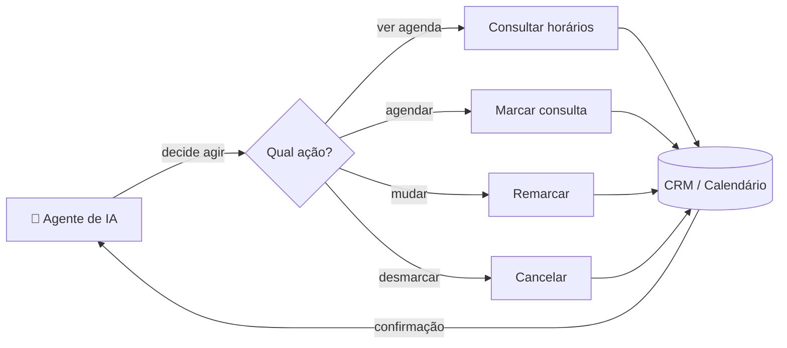

# 📅 Ferramentas de Agendamento via IA (CRM)

> Conjunto de **ferramentas (tools)** que um agente de IA chama para **marcar, remarcar e cancelar** consultas direto na agenda do CRM — com tratamento de horários, fuso e disponibilidade real.

> 🔒 **Case anonimizado.** Sem nome de cliente, credenciais ou dados reais.

---

## 🎯 O problema

Um agente de IA que só conversa não vende. Ele precisa **agir** — e a ação que mais importa numa clínica é **agendar**. Mas agendar de verdade é cheio de armadilha:

- Mostrar só horários **realmente livres** (sem dupla marcação).
- Respeitar **fuso horário** e janela de funcionamento.
- Lidar com **remarcação** e **cancelamento** sem bagunçar a agenda.
- Funcionar quando há **acompanhante** (2 vagas) ou regras especiais.

## ✅ A solução

Um catálogo de **sub-workflows reutilizáveis**, cada um exposto como uma ferramenta que o agente de IA invoca quando decide que é hora de agir:

| Ferramenta | O que faz |
|---|---|
| 🔍 **Consultar horários** | Lê a agenda do CRM e devolve só os slots livres |
| ✅ **Marcar consulta** | Cria o agendamento (com variante para acompanhante) |
| 🔄 **Remarcar** | Move um agendamento existente para novo horário |
| ❌ **Cancelar** | Cancela e libera o slot |
| 📝 **Anotar no contato** | Registra notas/resumo do atendimento no CRM |

---

## 🏗️ Arquitetura

O agente principal ([ai-receptionist-clinics](https://github.com/iTristaoo/ai-receptionist-clinics)) não conhece os detalhes de cada API — ele só sabe que existe uma ferramenta "marcar consulta". Toda a complexidade (formato de data, IDs de calendário, regras de slot) fica **encapsulada** em cada sub-workflow.

---

## 🧩 Destaques técnicos

- **Padrão tool-calling:** cada operação é um sub-workflow independente, versionável e testável isolado. O agente compõe ações sem saber da implementação.
- **Disponibilidade real:** consulta a agenda antes de oferecer horário — evita oferecer slot já ocupado.
- **Variantes de regra de negócio:** versão com acompanhante (reserva 2 vagas), cancelamento e reagendamento como fluxos separados, cada um com sua validação.
- **Reuso multi-clínica:** o mesmo conjunto de tools atende várias unidades trocando só as credenciais/IDs por configuração.
- **Tolerante a falha:** operações sobre o CRM tratam erro sem derrubar a conversa (a IA responde com elegância se a agenda estiver indisponível).

## 🧰 Stack

| Camada | Tecnologia |
|---|---|
| Orquestração | n8n (sub-workflows) |
| Agenda / CRM | GoHighLevel (Calendar + Contacts API) |
| Contrato com o agente | Tool-calling (LangChain Agent) |

## 📈 Resultados

> Exemplos do que medir:
> - 📅 % de agendamentos feitos **sem intervenção humana**
> - 🚫 Redução de erros de marcação (dupla marcação, horário inválido)
> - ⏱️ Tempo médio do "quero marcar" → "agendado"

---

## 🔗 Projetos relacionados

- [ai-receptionist-clinics](https://github.com/iTristaoo/ai-receptionist-clinics) — o agente que orquestra estas ferramentas
